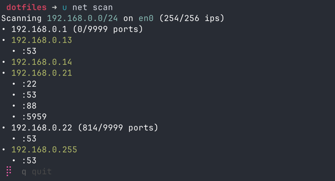

# Install

```shell
curl -s https://raw.githubusercontent.com/teadove/dotfiles/master/install.py | python3 -B
```

# Features
CLI utils
```shell
NAME:
   dotfiles - A new cli application

USAGE:
   dotfiles [global options] [command [command options]]

DESCRIPTION:
   set of useful command

COMMANDS:
   install  install all dotfiles, i.e. fish config
   update   updates this executable
   u        generates random uuid
   t        generates save to use password
   l        locates service by ip or domain from http://ip-api.com/json/
   g        git utils
   net      net utils
   sha      hashes string as sha512
   watch    like unix watch, but better
   ss       starship config swap
   code     analyse code
   help, h  Shows a list of commands or help for one command

GLOBAL OPTIONS:
   -v          verbose info
   --help, -h  show help
```

i.e. `u net scan`


